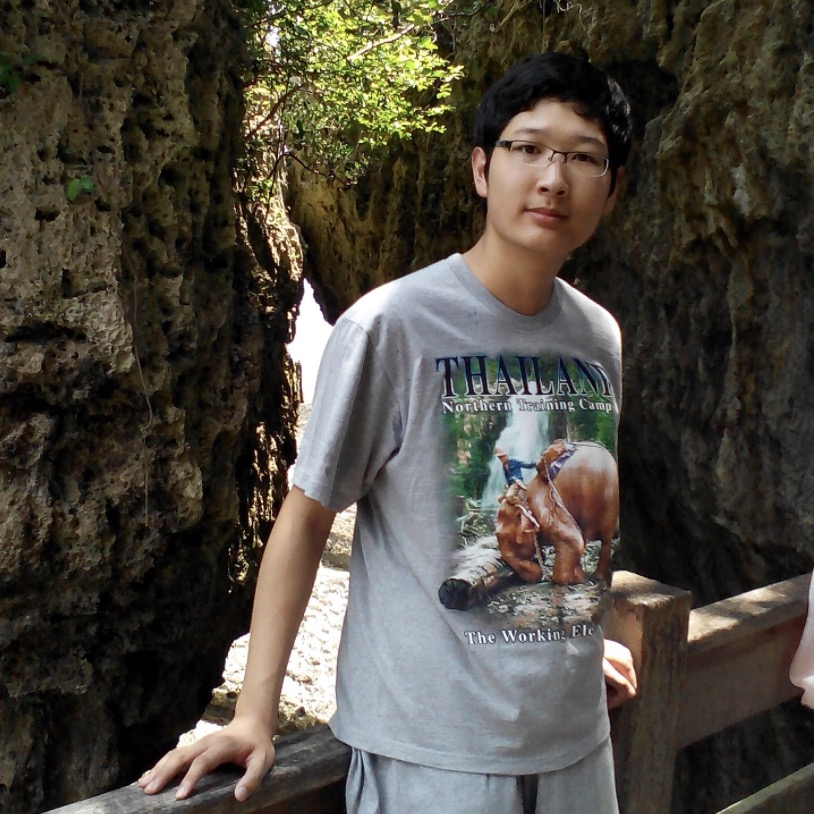
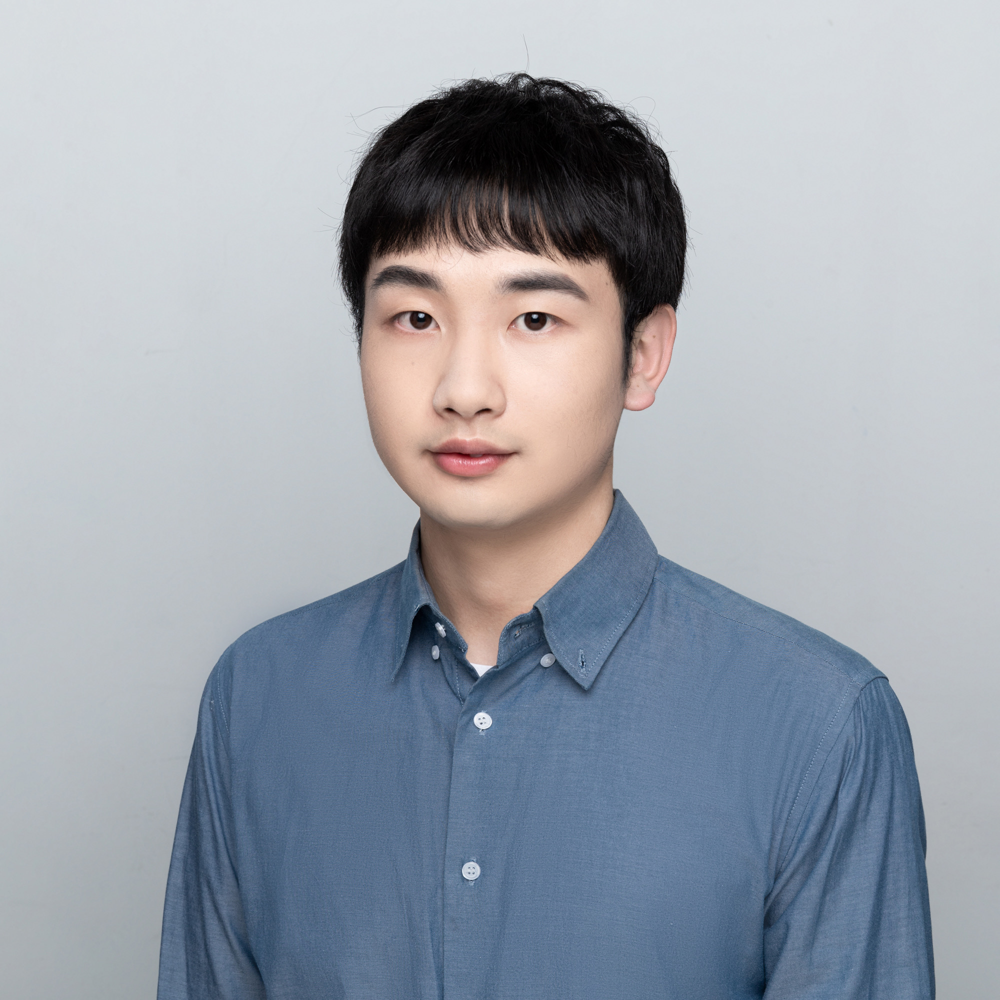
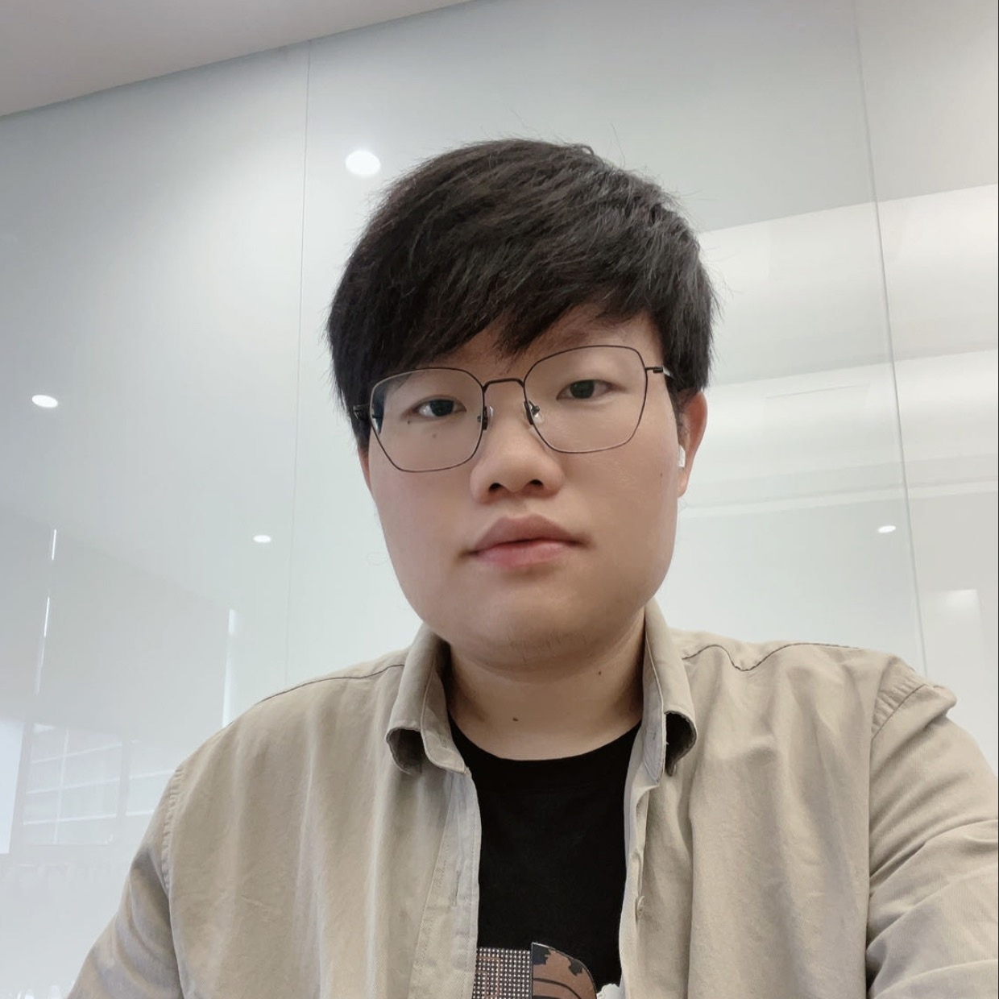

    

        The <b>HugAI Lab</b> is found by <a href="https://wjn1996.github.io">Jianing Wang</a> at the <b>East China Normal University</b> in 23-04-13. Our group is an open and working on some related research works on natural language processing (NLP) and machine learning (ML), focusing on prompt-based learning, large language models, low-resource learning. We have developed a unified and comprehensive <a href="https://github.com/HugAILab/HugNLP">HugNLP</a> library for improve convenience of research and development.
    

    

      HugAI Lab是一个开放的虚拟的组织，致力于开源AI项目，目前正在开发<a href="https://github.com/HugAILab/HugNLP">HugNLP</a>项目。HugAI Lab欢迎来自五湖四海各行各业的AI爱好者参与到开源项目。
    

## Hot Projects

## Groups

| People  | Join Time   |  Introduction  |
| ---   | --- | --- |
|  
[Jianing Wang](https://wjn1996.github.io/)
    | 2023.4   | A Ph.D. student at East China Normal University (ECNU), responsible for large language models, few-shot learning, knowledge graph. He has published several papers in ACL, AAAI, EMNLP and other top conferences.   华东师范大学博士生，HugAI Lab创始人，主要研究语言模型，小样本学习，知识图谱等。  |
|  
[Nuo Chen](https://scholar.google.com/citations?hl=zh-CN&user=yGKkT2wAAAAJ)
    | 2023.4   | A master student at East China Normal University (ECNU), responsible for the configuration of open source projects; engaged in the research and development of code intelligence and large language model related research.   华东师范大学硕士生，主要研究代码智能、语言模型等。  |
|  
[Qiushi Sun](https://qiushisun.github.io/)
  | 2023.4   | A master student at the National University of Singapore (NUS), engaged in code intelligent algorithm, pre-training model research, etc.; good at writing papers.   新加坡国立大学硕士生，本科毕业于华东师范大学。主要研究代码智能、语言模型等。  |
|  
[Taolin Zhang](https://www.tlzhang.com/)
  | 2023.5   | A Ph.D. student at East China Normal University (ECNU), dedicated to knowledge enhancement pre-training, information extraction, interpretability and text security controllable research, published several papers in ACL, AAAI, EMNLP and other top conferences.   华东师范大学博士生，本科毕业于山西大学。主要研究知识大模型、可解释性、安全可控生成等。       

If you wang to join us, you can:
- Commit a PR at our [repository](https://github.com/HugAILab).
- Write a letter and send to [Jianing Wang](mailto:lygwjn@gmail.com).