<a name="AtcoJ"></a>

<!-- # HugNLP发布，集成多种NLP任务，可训ChatGPT类模型 -->
<!-- 作者：王嘉宁 -->
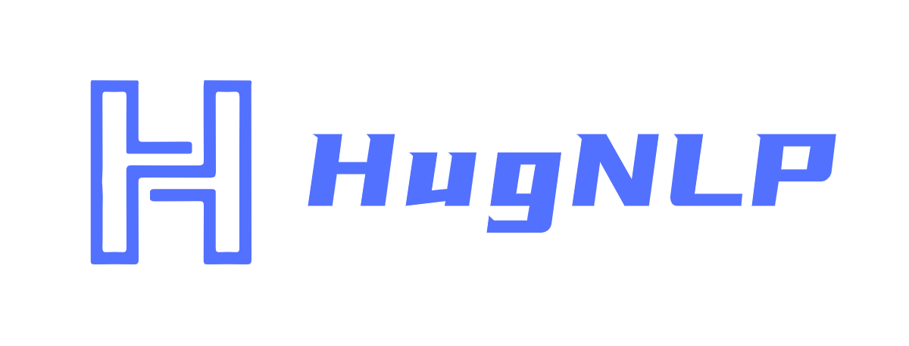
<a name="uZ9t2"></a>

#### HugNLP——全面统一的NLP框架开源了！
近日，华师大HugAILab团队研发了**HugNLP框架**，这是一个**面向研究者和开发者的全面统一的NLP训练框架**，可支持包括文本分类、文本匹配、问答、信息抽取、文本生成、小样本学习等多种NLP任务模型搭建和训练。


**开源地址**：[https://github.com/HugAILab/HugNLP](https://github.com/HugAILab/HugNLP)

**论文**：[https://arxiv.org/abs/2302.14286](https://arxiv.org/abs/2302.14286)

值得注意的是，**HugNLP还集成了大量最新的Prompt技术**，例如Prompt-Tuning、In-Context Learning、Instruction-tuning，未来还将引入Chain-of-thought。

HugAILab团队还研发了一系列的应用，例如**CLUE&GLUE刷榜工具**，可支持ChatGPT类模型训练和部署产品**HugChat**，以及统一信息抽取产品**HugIE**等。

HugNLP是一个分层式框架，遵循“**高内聚低耦合**”的开发模式，其核心包括模型层（Models）、处理器层（Processors）、评估器层（Evaluators）和应用层（Applications）四部分。框架图如下所示：

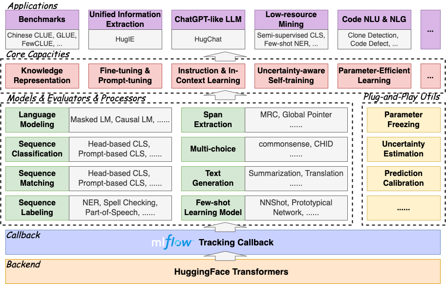

- **模型层**：包含模型部分，主要按照任务类型进行划分；
- **处理器层**：对数据进行加载、缓存、分词等处理，并转换为模型输入的Tensor；
- **评估器层**：根据不同类型的任务（分类或生成），指定不同的评估流程和评价指标；
- **应用层**：对应的应用执行脚本。理论上来说，选定一个模型、一个数据处理器以及一个评估器，即可对应一个应用。

HugNLP完全基于HuggingFace开发，具有**易扩展**、**易部署**能力，同时集成了MLFlow训练追踪器，方便使用者及时追踪实验进度，并进行实验分析。

HugNLP框架之所以称为全面，是因为其集成了大量的NLP任务模型，目前已经实现的包括：

- **预训练**：Masked LM、Causal LM、知识增强预训练；
- **Instruction-Tuning**：支持自回归生成式、区间抽取式、NLI等统一范式训练；
- **文本分类/匹配**：传统Fine-tuning、Prompt-tuning、In-Context Learning；
- **序列标注：** 支持NER等序列标注任务；
- **元学习：** 基于序列的元学习（SentenceProto）、基于区间的元学习（SpanProto）、基于token的元学习（TokenProto，NNShot）；
- **问答**：支持抽取式问答、多项选择式问答、开放生成式问答；
- **文本生成**：支持文本摘要、机器翻译（正在开发中）；
- **代码智能**：目前集成了代码克隆检测（Clone）、代码缺陷检测（Defact）等Code任务；

快速部署HugNLP框架，只需要执行代码三行命令即可：
> git clone [https://github.com/HugAILab/HugNLP.git](https://github.com/HugAILab/HugNLP.git)

> cd HugNLP

> python3 setup.py install


下面介绍HugNLP的几个核心能力：

- Benchmark一键刷榜；
- 预训练和知识注入；
- Fine-tuning & Prompt-tuning；
- Instruction-tuning；
- In-Context Learning；
- 半监督Self-training；
- Code代码智能；
<a name="d03v1"></a>

## 一、Benchmark一键刷榜
HugNLP最先开发了面向一些常用榜单的刷榜工具，例如GLUE、CLUE等。用户只需要配置相应的数据集名称，即可实现一键刷榜。为了验证框架的有效性，在22年9月提交了CLUE榜单的刷榜结果，选择一系列中文小模型（RoBERTa、MacBERT、P-BERT等）并结合了logits集成方法，至今依然维持在第15名位置，曾一度超越了部分企业。

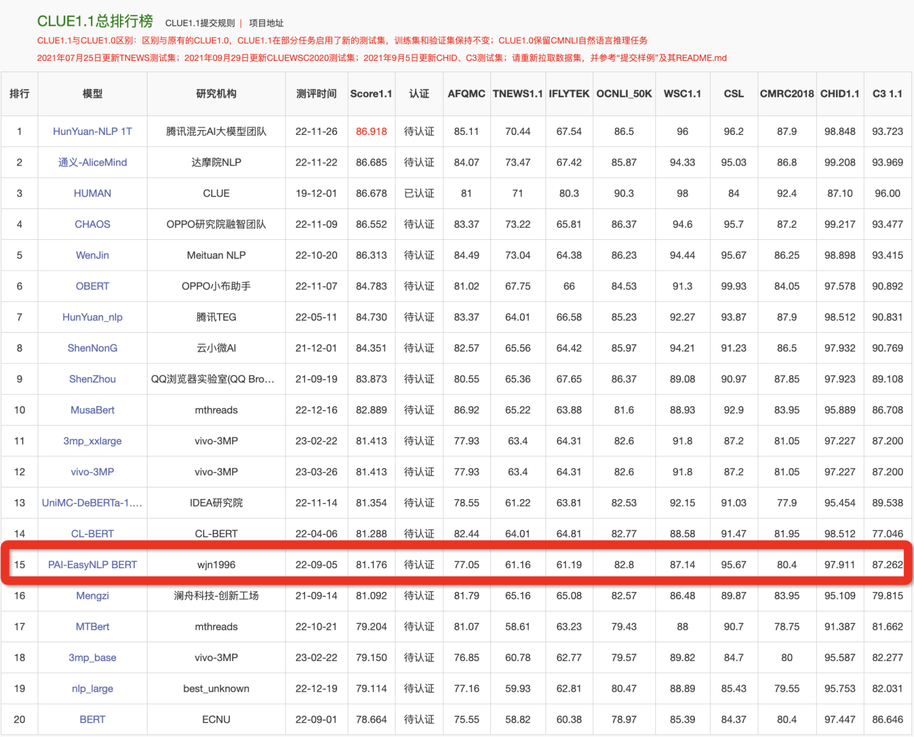

例如如果训练CLUE榜单的AFQMC数据集，可编辑文件
> applications/benchmark/clue/clue_finetune_dev.sh

修改参数：
>  --user_defined="data_name=afqmc"

执行下列命令即可：
> bash applications/benchmark/clue/clue_finetune_dev.sh


同样的方法还可以训练一些常用的NLP任务，例如阅读理解、实体识别、以及GLUE英文数据集等。

HugNLP还集成了一系列模型用于刷榜，例如BERT、RoBERTa、DeBERTa、MacBERT、Erlangshen等。
<a name="shsfK"></a>

## 二、预训练与知识注入
传统的一些预训练模型（例如BERT、GPT2等）是在通用语料上训练的，而对领域事实知识可能不敏感，因此需要显式的在预训练阶段注入事实知识。

在HugNLP中，主要实现了几个知识增强预训练，包括DKPLM和KP-PLM。DKPLM是一种可分解的知识注入方法；KP-PLM则是将结构化知识转化为自然语言描述的形式进行注入。这些知识注入的方法是可插拔式的，因此无需修改模型结构，很容易用于下游任务的微调。

执行下面命令即可进行Masked Language Modeling和Causal Language Modeling的预训练：
> bash applications/pretraining/run_pretrain_mlm.sh

> bash applications/pretraining/run_pretrain_casual_lm.sh


<a name="l1zqb"></a>

## 三、 Fine-tuning & Prompt-Tuning
基于预训练语言模型的NLP，通常遵循Pre-training和Fine-tuning范式。HugNLP也包含Fine-tuning技术。
<a name="JXuDH"></a>

#### 3.1 参数有效性学习：
HugNLP集成了包括Prefix-tuning、Adapter、BitFit、LoRA等参数有效性训练方法，可以加速模型的训练，降低显存占用量。

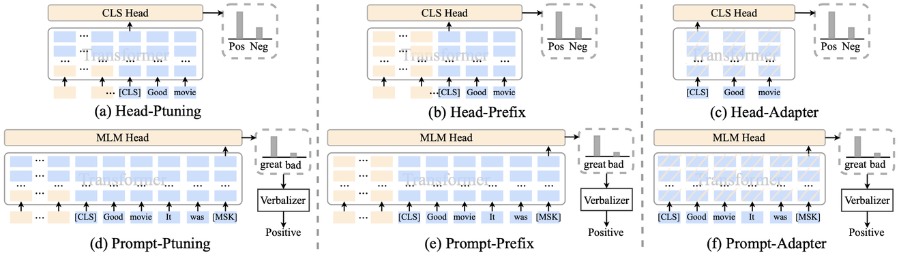

在训练脚本中，只需要添加一行参数，即可开启参数有效性训练：
> --use_freezing

对于参数有效性方法，HugNLP实现了若干类别的分类模型，如下所示：
```python
CLASSIFICATION_MODEL_CLASSES = {
    "head_prefix_cls": {
        "bert": BertPrefixForSequenceClassification,
        "roberta": RobertaPrefixForSequenceClassification,
    },
    "head_ptuning_cls": {
        "bert": BertPtuningForSequenceClassification,
        "roberta": RobertaPtuningForSequenceClassification,
    },
    "head_adapter_cls": {
        "bert": BertAdapterForSequenceClassification,
        "roberta": RobertaAdapterForSequenceClassification,
    },
    "masked_prompt_cls": {
        "bert": PromptBertForSequenceClassification,
        "roberta": PromptRobertaForSequenceClassification,
    }, 
    "masked_prompt_prefix_cls": {
        "bert": PromptBertPrefixForSequenceClassification,
        "roberta": PromptRobertaPrefixForSequenceClassification,
    },
    "masked_prompt_ptuning_cls": {
        "bert": PromptBertPtuningForSequenceClassification,
        "roberta": PromptRobertaPtuningForSequenceClassification,
    },
    "masked_prompt_adapter_cls": {
        "bert": PromptBertAdapterForSequenceClassification,
        "roberta": PromptRobertaAdapterForSequenceClassification,
    },
}
```
只需要指定下面参数即可，例如选择adapter进行分类：
> --task_type=head_adapter_cls


<a name="VwM8v"></a>
#### 3.2 对抗训练：引入对Embedding的扰动，提高模型的鲁棒性。
HugNLP框架集成了若干种对抗训练的方法，其中最简单的对抗方法为FGM算法：

- 首先计算输入样本$x$（通常为word embedding）的损失函数以及在$x$处的梯度：$g=\triangledown_xL(\theta, x, y)$；
- 计算在输入样本的扰动量：$r_{adv} = \epsilon\cdot g/||g||_2$，其中$\epsilon$为超参数，默认取1.0；
- 得到对抗样本：$x_{adv} = x + r_{adv}$；
- 根据得到的对抗样本，再次喂入模型中，计算损失，并累积梯度；
- 恢复原始的word embedding，接着下一个batch。

在训练时，只需要添加一行参数，即可默认调用FGM算法：
> --do_adv

<a name="wKDiJ"></a>

#### 3.3 Prompt-tuning：通过模板来复用预训练目标
传统的Fine-tuning在低资源场景下容易出现过拟合问题，因此复用预训练的目标可以拉近Pre-training和Fine-tuning之间的语义差异。

HugNLP集成了PET、P-tuning、Prefix-tuning等Prompt-Tuning算法，并无缝嵌入在NLP分类任务的模型里。

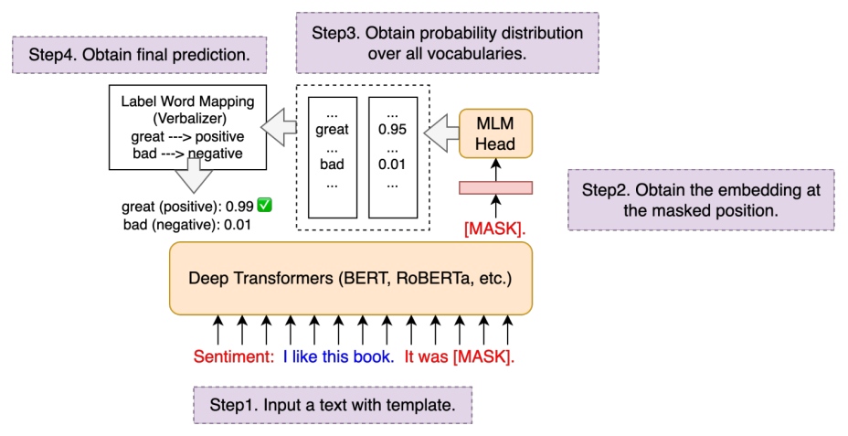

在训练时，只需要指定下面两个参数，即可以开启Prompt-tuning模式，例如选择p-tuning算法：

> --task_type=masked_prompt_ptuning_cls

> --use_prompt_for_cls


<a name="I3VCV"></a>

## 四、Instruction-tuning
在大模型时代，如何将不同类型的NLP任务进行范式统一，是构造通用人工智能的核心要素。HugNLP为此定义了三种统一范式的思想：

- **万物皆可生成**：将所有NLP任务建模为单向自回归生成，例如GPT-3、ChatGPT等；
- **万物皆可抽取**：将所有NLP任务建模为抽取式机器阅读理解；
- **万物皆可推断**：将所有NLP任务建模为自然语言推断；

基于三种不同的范式统一，HugNLP推出两个核心产品，分别是：

- **HugChat**：基于生成式Instruction的中小型ChatGPT类模型；
- **HugIE**：基于抽取式Instruction的统一信息抽取框架；
<a name="BSGWx"></a>

#### 4.1 HugChat：基于Causal Language Modeling的生成式对话模型
最近ChatGPT火爆全球，为了让研究者可以训练自己的ChatGPT，HugNLP框架集成了基于生成式Instruction的训练产品——HugChat，其支持**各种类型的单向生成式模型的训练**，例如GPT-2、GPT-Neo、OPT、GLM、LLaMA等。
**在8张V100 32G的条件下，可训练OPT-13B大模型。**
HugAILab团队开源了约200万条英文、300万条中文对话数据，用于训练模型。
例如训练GPT-2（XL），可直接执行脚本：
> bash ./application/instruction_prompting/HugChat/supervised_finetuning/run_causal_instruction_gpt2_xl.sh

基于HugNLP，训练的GPT-2（1.3B）模型，即可实现很简单的对话任务。只需要执行如下命令即可玩转HugChat：
> python3 applications/instruction_prompting/HugChat/hugchat.py

例如可以写套磁信邮件：
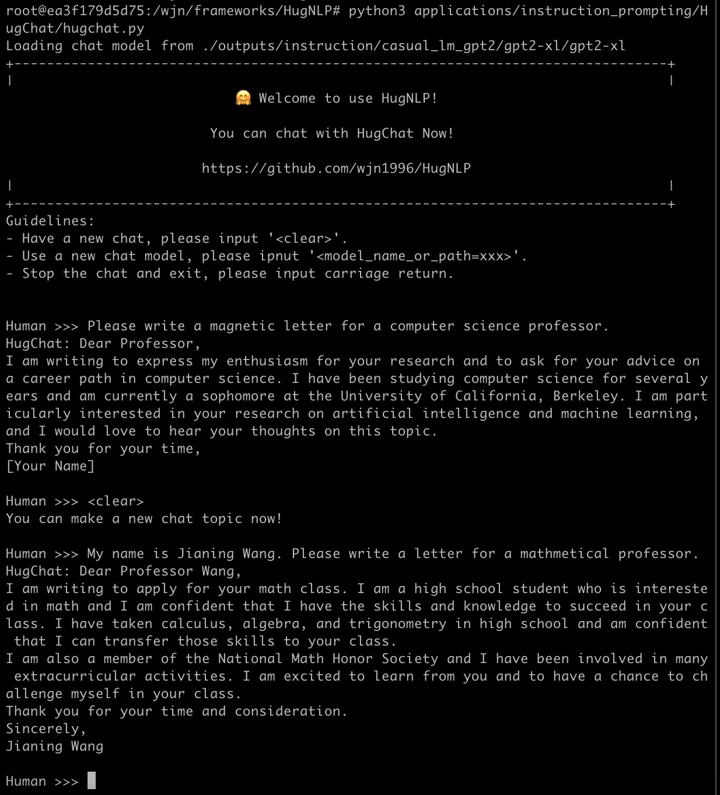
再例如搜索谷歌地球的相关信息：
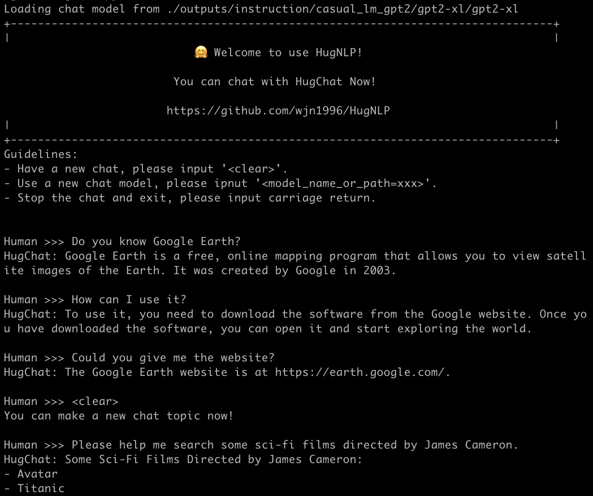
也可以实现编写简单的代码（1.3B的模型具备此能力已经很惊叹了！）：
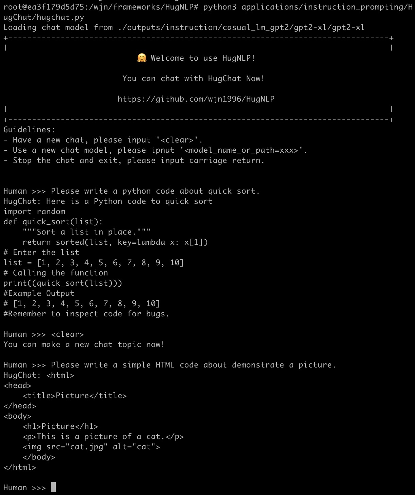
HugNLP目前正在开发其他类型的Decoder-only大模型，相关信息和开源内容如下表所示：
HugChat后期将推出垂直领域的大模型解决方案，同时将与OpenAI API进行融合，推出大模型服务框架。

<a name="E3176"></a>

#### 4.2 HugIE：基于Global Pointer的统一信息抽取框架
**信息抽取（Information Extraction）** 旨在从非结构化的文本中抽取出结构化信息，是构建知识库的重要步骤之一。通常信息抽取包括两个核心步骤，分别是 **命名实体识别（Named Entity Recognition）** 和 **关系抽取（Relation Extraction）**。

我们基于HugNLP研发一款HugIE产品，旨在实现统一信息处理。其主要核心包括如下几个部分：

- 将实体识别和关系抽取，统一为新的范式——基于抽取式阅读理解的方法。HugIE采用Global Pointer模型实现信息抽取；
- 定义Instruction Prompt，指导模型生成需要抽取的内容；
- 采用多任务训练的方法训练；

HugIE目前已经开源了模型：[https://huggingface.co/wjn1996/wjn1996-hugnlp-hugie-large-zh](https://huggingface.co/wjn1996/wjn1996-hugnlp-hugie-large-zh)
可以基于HugNLP框架使用HugIE抽取模型，如下图所示：
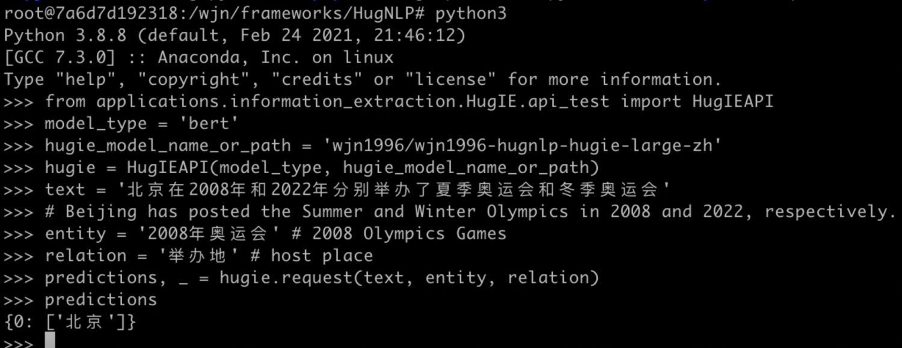

<a name="vuMNL"></a>

## 五、In-Context Learning
**In-Context Learning（ICL）** 首次由GPT-3提出，其旨在挑选少量的标注样本作为提示（Prompt），从而在形式上促使大模型生成目标答案。ICL的优势在于无需对参数进行更新，即可实现惊艳的效果。

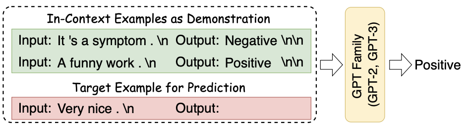

HugNLP框架集成了ICL，主要涉及到**样本的挑选**和**预测结果的校准**两个部分：

- **样本挑选**：默认为从训练集中随机挑选样本，后期将会开发一系列样本挑选的算法，例如聚类、K近邻、余弦相似度等；
- **预测校准**：由于所挑选标注样本与待预测样本存在分布差异，需要对预测的概率分布进行校准，这里采用**Calibrate Before Use**方法，如下图，可以对预测分布进行校准，提高预测效果。

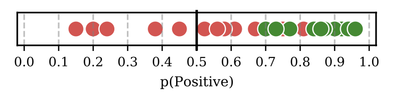

目前ICL已经集成在HugNLP里，只需要指定下面参数即可：
> --user_defined="data_name=xxx num_incontext_example=4 l=1 use_calibrate=True"

> --use_prompt_for_cls

<a name="NGM09"></a>

## 六、半监督Self-training
半监督旨在同时结合标注数据和无标签数据来训练NLP任务。Self-training是一种简单但有效的迭代式训练方法，其通过Teacher模型先获取伪标签，对伪标签进行去噪后，再训练Student模型。传统的Self-training会引入大量噪声，从而降低训练的效果。为了提高性能，HugNLP引入成熟的**Uncertainty-aware Self-training**技术。框架图如下所示：
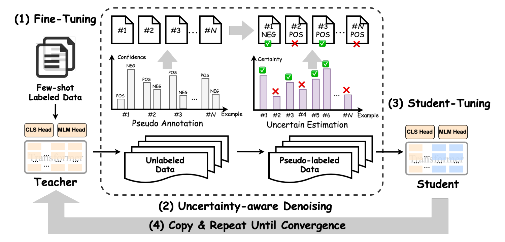
其采用了来自贝叶斯推断中的**MC Dropout技术**，即对Teacher模型执行 $T$次推理，每次推理开启Dropout开关，从而得到若干与Teacher模型满足独立同分布的模型预测。基于这些预测结果，可以通过信息熵的变化量得到Teacher模型对无标签数据的不确定性量化指标（即BALD算法），核心公式如下：
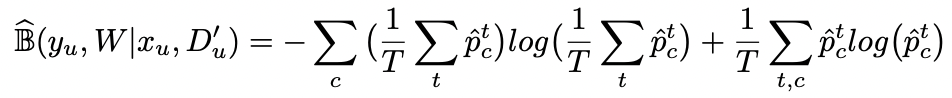
进行多次DC Dropout的代码实现如下（详见hugnlp_trainer.py）：

```python
y_T = list()
for i in tqdm(range(T)):
    y_pred = []

    for step, inputs in enumerate(unlabeled_dataloader):
        _, logits, __ = self.prediction_step(model, inputs, prediction_loss_only, ignore_keys=ignore_keys)
        y_pred.extend(logits.detach().cpu().numpy().tolist())
    predict_proba = torch.softmax(torch.Tensor(y_pred).to(logits.device), -1)
    y_T.append(predict_proba.detach().cpu().numpy().tolist())

y_T = np.array(y_T)
#compute mean
y_mean = np.mean(y_T, axis=0)
```
BALD算法实现如下：
```python
def get_BALD_acquisition(y_T):
	expected_entropy = - np.mean(np.sum(y_T * np.log(y_T + 1e-10), axis=-1), axis=0)
	expected_p = np.mean(y_T, axis=0)
	entropy_expected_p = - np.sum(expected_p * np.log(expected_p + 1e-10), axis=-1)
	return (entropy_expected_p - expected_entropy)
```

HugNLP使用半监督模式，只需要做两件事：

（1）执行脚本时添加参数：
> --use_semi

（2）在指定的数据集目录下，存放unlabeled data文件。

<a name="zMxlB"></a>
## 七、其他更丰富的应用
目前HugNLP还开发了很多应用如下所示：
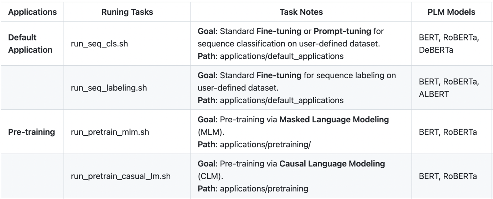
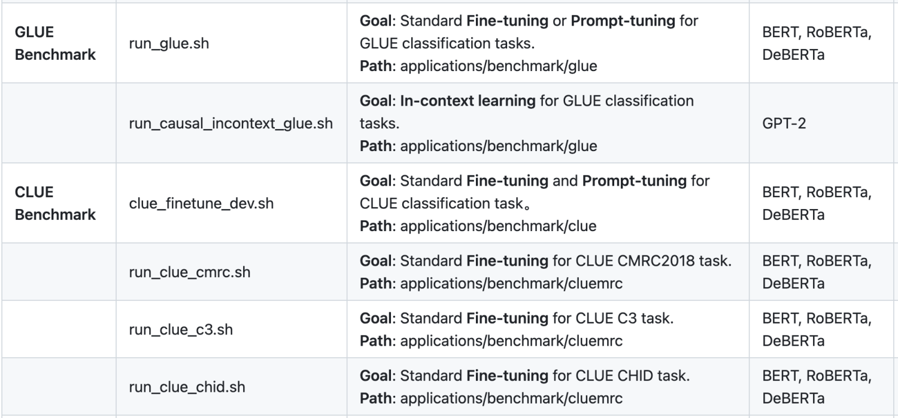
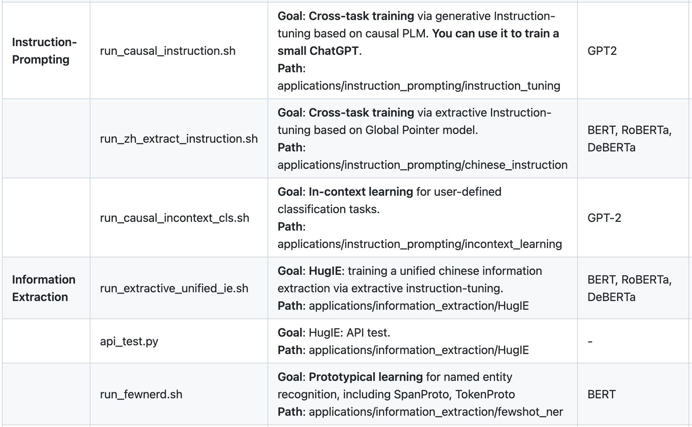
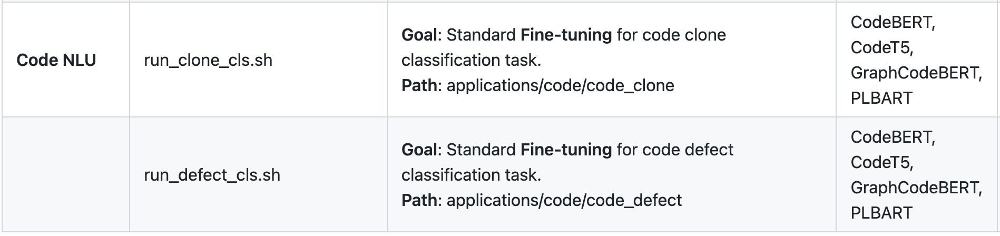
还有更多丰富的应用正在开发中。HugNLP也欢迎有志之士加入HugAILab参与开源开发工作**🤗**。

HugNLP开源地址：[https://github.com/HugAILab/HugNLP](https://github.com/HugAILab/HugNLP)

论文：[https://arxiv.org/abs/2302.14286](https://arxiv.org/abs/2302.14286)

---

<a name="HB9Zj"></a>
#### 获取更多咨询，可加入钉钉用户群：
<a name="jmhM7"></a>
#### 

---

<a name="DzNaf"></a>
### 团队介绍
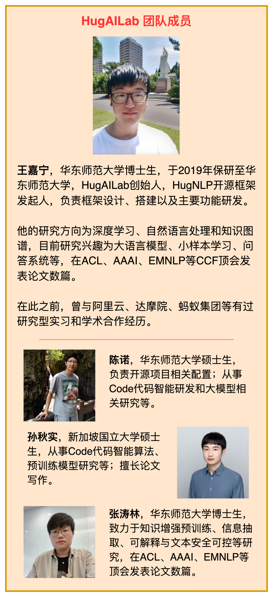

---


